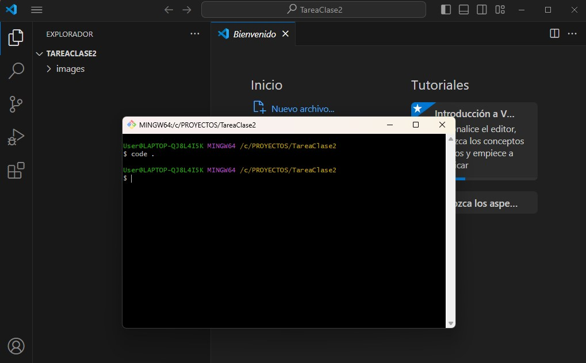
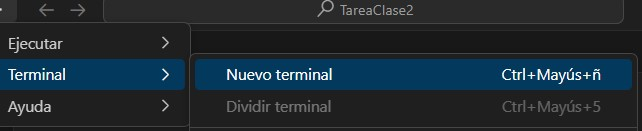
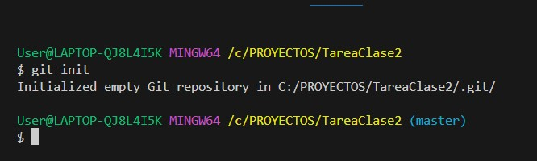
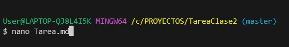
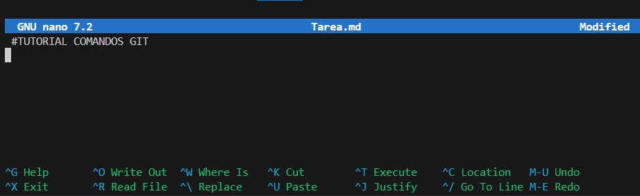
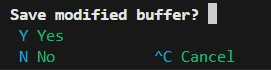
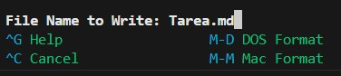
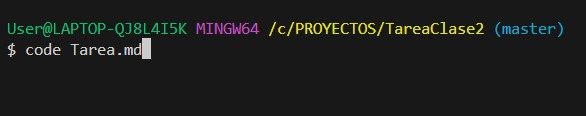

 # TUTORIAL COMANDOS GIT #

1. Desde la terminal escribimos **"code ."** para abrir el Visual Studio Code.

2. Una vez en el Visual Studio Code nos dirigimos al menú en la parte superior al lado de **Ir** que tiene **...** >> **Terminal** >> **Nuevo Terminal**

3. Creamos un nuevo Repositorio con el comando **"git init"**

4. Luego Creamos un nuevo archivo dentro de     nuestro repositorio con el comando **"nano ___nombreDelArchivo.extension"___**

    Ponemos informacion dentro del archivo si queremos.

    Luego oprimimos la tecla **"Ctrl + X"** para cerrar, el paso a seguir es oprimir la tecla **"Y"** para guardar..

    Finalmente le damos **"Enter"** para concluir.

5. Ahora abrimos nuestro archivo con Visual Studio Code con el siguiente comando **"code ___nombreDelArchivo.Extension___**  para trabajar en el.

